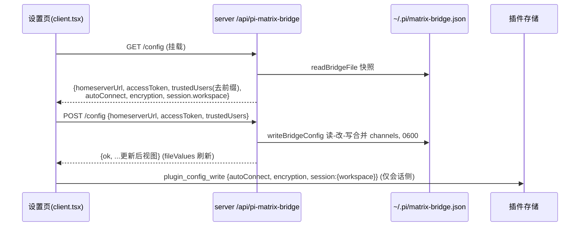

# Superpower Design: matrix-bridge-config-import-mirror-fix

> 实现层细化。事实源：`openspec/changes/matrix-bridge-config-import-mirror-fix/{proposal.md, design.md, specs/matrix-bridge-plugin/spec.md}`。本文档实现 open-point 的落定与逐文件改造细节。

## 1. 架构总览（方向：原生文件为唯一连接/配对配置源）

### 1.1 配置的三类数据与其归属

| 数据 | 存储位置 | 读写通道 |
|---|---|---|
| 连接：`matrix.{homeserverUrl, accessToken}` | `~/.pi/matrix-bridge.json`（原生） | 设置页 `GET`/`POST /api/pi-matrix-bridge/config` |
| 配对：`auth.{trustedUsers[], channels{}}` | 同上（trustedUsers 以 `matrix:` 前缀存储；channels 仅扩展写入） | 同上（channels 只读合并，WebUI 不编辑） |
| 会话侧：`workspace` / `autoConnect` / `encryption` | 插件存储 `plugins.pi-matrix-bridge.*` | 既有 `usePluginConfig` + `plugin_config_write` |
| 生命周期：`enabled` | 插件存储 | dashboard 开关（不变） |

### 1.2 Boot 数据流

```mermaid
flowchart TD
    B[dashboard server boot 注册插件] --> R[readBridgeFile ~/.pi/matrix-bridge.json 快照]
    R --> S{文件有效?}
    S -- 否 --> E[fileValues = null<br/>静默降级: 空表单 / 不自动启动]
    S -- 是 --> F[fileValues = parse(matrix.* + auth)]
    F --> G[effective = 快照连接 + readConfig 会话侧字段]
    E --> G
    G --> H{autoConnect<br/>且连接可用?}
    H -- 是 --> I[BackgroundSession.start → spawn pi print<br/>env: PI_MATRIX_BRIDGE_HOMESERVER/ACCESS_TOKEN/AUTO_CONNECT]
    H -- 否 --> J[stopped]
```

### 1.3 WebUI 保存数据流



## 2. 端点契约（新增）

### GET /api/pi-matrix-bridge/config
- 200 → `{ ok: true, homeserverUrl: string, accessToken: string, autoConnect: boolean, encryption: boolean, session: { workspace: string }, auth: { trustedUsers: string[] } }`
- 连接/配对来自快照（无文件 → 空串/空数组）；会话侧来自 `readConfig()` 存储。
- 幂等；无副作用。

### POST /api/pi-matrix-bridge/config
- Body：`{ homeserverUrl: string, accessToken: string, trustedUsers: string[] }`（不含会话侧字段）
- 成功 200 → `{ ok: true, ...更新后视图 }`（视图同 GET）；失败 400（无文件且连接全空）/ 500（写盘失败，body `{ ok: false, error }`）。
- 写入：嵌套 `matrix.{homeserverUrl,accessToken}`（仅当连接字段非空才写 `matrix` 对象）；`auth.trustedUsers` = body 列表加 `matrix:` 前缀；`auth.channels` = 读回既有值合并（快照里的 channels 不可靠 —— 每次写前读文件取 channels）；0600；父目录 mkdir。

## 3. 逐文件改造

### 3.1 `src/server/mirror.ts` → 更名 `src/server/bridge-file.ts`
- 删除：`toBridgeFile`、`writeBridgeFile`、`redact`、`BridgeFileJson` 扁平化.
- 新增适配器：
  - `readBridgeFile(target?): Promise<BridgeFileJson | null>`（保留既有实现，容错 null）
  - `flattenBridgeFile(file: BridgeFileJson | null): { homeserverUrl: string; accessToken: string; trustedUsers: string[] }` — 展平 `matrix.*`，`trustedUsers` 去前缀（null → 空）
  - `writeBridgeConfig(input: { homeserverUrl: string; accessToken: string; trustedUsers: string[] }, target?): Promise<BridgeFileJson>` — 写嵌套文件、加前缀、合并 channels、0600；连接全空且文件不存在 → 抛 `BridgeConfigError`
  - `stripMatrixPrefix(id: string): string`（保留）
- `BridgeFileJson` 类型保持 `{ matrix: { homeserverUrl, accessToken }, auth: { trustedUsers, channels } }`（读侧不变）。

### 3.2 `src/server/index.ts`
- `ServerBridgeOptions`：`mirrorTarget` → `filePath?: string`（注入文件路径；生产缺省 `bridgeFilePath()`）。
- 删除：`runMirror`、`MIRROR_ERROR_TYPE`、注册期/启停动作中的镜像调用、`import { writeBridgeFile }`。
- 新增：
  - `let fileValues = await readBridgeFile(opts.filePath ?? bridgeFilePath())`
  - `const effective = (): MatrixBridgeConfig => ({ ...readConfig(), homeserverUrl: fileValues?.matrix.homeserverUrl ?? "", accessToken: fileValues?.matrix.accessToken ?? "", auth: { ...readConfig().auth, trustedUsers: [...readConfig().auth.trustedUsers, ...(fileValues ? fileValues.auth.trustedUsers.map(stripMatrixPrefix) : [])] } })` — 注意去重（Set）。
  - 自动启动：`const initial = effective(); if (initial.autoConnect && initial.homeserverUrl && initial.accessToken) await bridge.start()`。
  - `GET /config`：`const view = viewOf(effective(), fileValues)`（见客户端契约）。
  - `POST /config`：读 body → `writeBridgeConfig(body, target)` → `fileValues = 新快照` → 返回更新视图；异常 → 400/500。
- 转发门：`effective().auth.trustedUsers.length > 0`（配对用户含文件用户）。
- 注意：`readConfig()` 每次调用都新鲜读存储；`effective` 每次组合，保证存储会话侧字段变化即时生效。

### 3.3 `src/types.ts`（不变）
- `MatrixBridgeConfig` 形态不变（合并视图类型）；`matrixUserId`/`isUserMatrixId`/`EMPTY_CONFIG` 保留。

### 3.4 `src/client.tsx`
- 新增 state：`conn` `{ homeserverUrl, accessToken, trustedUsers }`、`connError`。
- 挂载 effect：`GET /config` → `setConn(视图)`；失败静默（空表单）。
- 表单连接/配对绑定 `conn`；`workspace`/`encryption`/`autoConnect` 维持 `usePluginConfig` + `hydratedRef` 水合（仅会话侧）。
- `saveConnection()`：`POST /config { homeserverUrl, accessToken, trustedUsers: conn.trustedUsers }` + `persist({ autoConnect, encryption, session:{workspace} })`（会话侧仍走 `plugin_config_write`）。
- `addUser`/`removeUser`：改 `conn.trustedUsers` 后 `POST /config`（不再 `persist({auth:...})`）。
- 移除：`config.auth?.trustedUsers` 作为配对来源、配对相关 `persist` 调用、来源提示（源即为文件）。

### 3.5 `configSchema.json`
```json
{
  "$id": "@blackbelt-technology/pi-matrix-bridge-plugin/configSchema",
  "description": "Session-side plugin config (workspace/autoConnect/encryption). Connection+pairing config lives in the native bridge file ~/.pi/matrix-bridge.json — never persisted here.",
  "type": "object",
  "properties": { "autoConnect": { "type": "boolean" }, "encryption": { "type": "boolean" }, "session": { "type": "object", "properties": { "workspace": { "type": "string" } } } },
  "required": ["autoConnect", "encryption", "session"],
  "additionalProperties": false
}
```

### 3.6 测试
- `test/unit/mirror.test.ts` → `test/unit/bridge-file.test.ts`（重命名 + 重写；见 §4 用例清单）
- `test/unit/server.test.ts`：镜像断言删除/改写；新增注册期快照自动启动、`GET`/`POST /config` real-fastify 用例（`makeCtx` 增 fastify 覆写参）。
- `test/unit/client.test.tsx`：fetch mock 改为按 URL 路由；配对经 `POST /config`；种子来自 `GET /config`；删除 `plugin_config_write` 配对断言。

## 4. 边界矩阵（Edge Cases）

| # | 边界 | 行为 | 验证位置 |
|---|---|---|---|
| E1 | 文件不存在 | `readBridgeFile` → null；表单空；不自动启动；不报错 | bridge-file.test / server.test |
| E2 | 文件 JSON 损坏 | null（静默） | bridge-file.test |
| E3 | 文件缺 `matrix` 对象或字段非 string | null（视为无效） | bridge-file.test |
| E4 | 文件 `matrix.{homeserverUrl,accessToken}` 为空串 | 视为无连接：表单空、不自动启动；保存时按「连接全空」处理 | bridge-file.test / server.test |
| E5 | trustedUsers 混合 `matrix:` 前缀与非前缀 | 仅剥 `matrix:` 前缀；非前缀原样 | bridge-file.test |
| E6 | channels 已有房间权限 | 写回时合并保留（读-改-写） | bridge-file.test（写前种子文件） |
| E7 | 写盘失败（权限/磁盘） | 400/500 + 设置页错误提示；不落存储 | server.test（mock 失败路径） |
| E8 | 父目录不存在 | mkdir recursive 后写入 | bridge-file.test |
| E9 | 存储有旧连接字段残留 | schema 收窄：下次 `plugin_config_write` 重写清除；`effective` 仍以文件连接为准 | client.test（persist 后 config 不含连接键） |
| E10 | 连接字段全空且文件不存在 | `POST /config` → 400（防误建空文件） | server.test |
| E11 | 外部改文件（扩展 configure 命令） | 快照不感知（文档化）；设置页刷新（重新 GET）或重启后可见 | 文档 |
| E12 | 保存后运行中会话不换 env | 需 `/restart`；文档化 | 文档 |

## 5. 验证清单

1. `cd packages/pi-matrix-bridge-plugin && npx vitest run`（桥文件/服务器/客户端/会话/types 全绿）。
2. 本机手工：重启 dashboard → 设置页显示文件连接 + 配对去前缀；保存 → 文件嵌套不变、channels 保留、权限 600；存储无连接键。
3. `openspec validate` 通过；tasks.md 与 superpower-plan.md 一一对应。